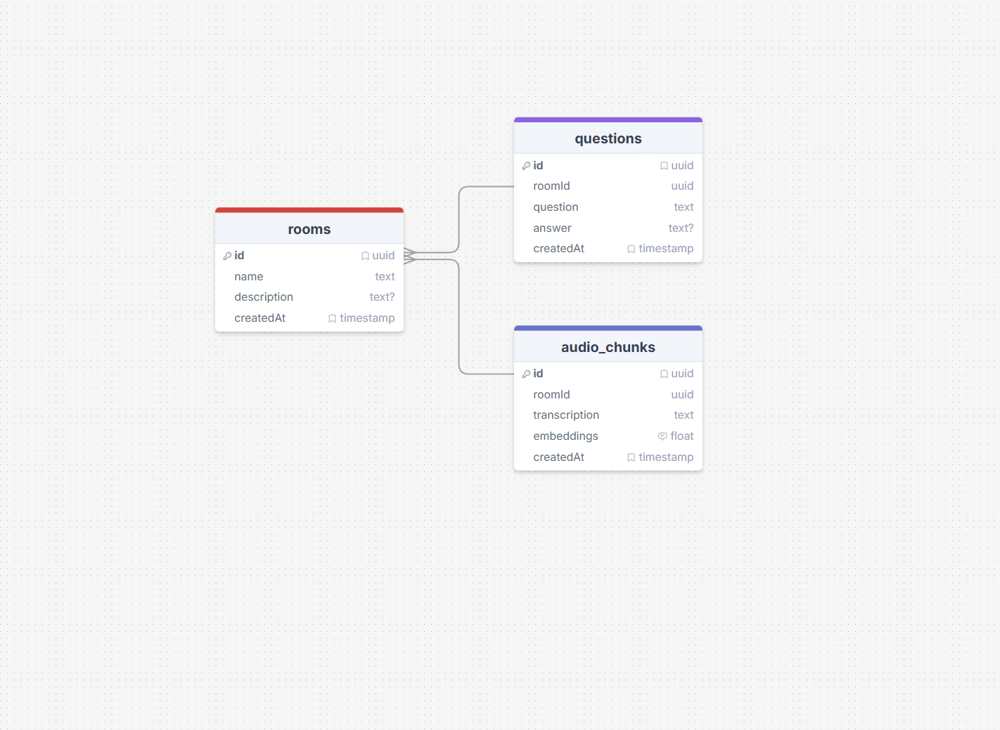

# 🤖 Let me ask - API

Let me ask is an fastify API with Typescript for managing rooms, questions, and audio transcription/embedding. This API uses Drizzle ORM with PostgreSQL and integrates with Google Gemini API for audio transcription, text embeddings and answer generation.

## 🤖 PROTOTYPE



## 📒 Features

- **TypeScript**: Provides static typing and modern JavaScript features for safer and scalable development.
- **Fastify**: Web framework for building high-performance APIs.
- **Drizzle ORM**: Simplifies database access and migrations with type safety, used with PostgreSQL.
- **PostgreSQL**: Relational database for storing rooms, questions, and audio chunks.
- **Zod**: Schema validation for request inputs, ensuring data integrity in routes.
- **Google Gemini API**: Handles audio transcription, text embeddings, and answer generation using AI.
- **drizzle-seed**: Utility for seeding the database with test data.
- **fastify/cors & fastify/multipart**: Enable CORS for frontend integration and handle file uploads.

## 📇 Main Features
- **Rooms:** Create and manage rooms (`POST /rooms`).
- **Questions:** Create questions for rooms, with automatic answer generation using similar audio transcriptions (`POST /rooms/:roomId/questions`).
- **Audio Chunks:** Upload audio, and store embeddings for similarity search.
- **Embeddings:** Uses Gemini API for text embeddings and vector similarity in SQL.

## 🛠️ Run the Project

- Before using this app, it's highly recommended to install the latest versions of [Node](https://nodejs.org/) and [Docker Desktop](https://www.docker.com/products/docker-desktop/) on your machine. Make sure to follow all the installation and configuration steps provided by their official documentation.

# 🛠️ Configuration

  - To install the node modules package, run the code bellow:
  ```bash
    npm install
  ```

  - To create a container on docker, run the code bellow:
  ```bash
    docker compose up -d
  ```

  - To check if the container was created, run the code bellow:
  ```bash
    docker ps
  ```

  - To generate the migrations on database, run the code bellow:
  ```bash
    npm run db:generate
  ```
  
  - To execute the migrations on database, run the code bellow:
  ```bash
    npm run db:migrate
  ```

  - to populate the database with fake data, run the code bellow:
  ```bash
    npm run db:seed
  ```

## 🗂️ Key Files & Directories
- Entrypoint: `src/server.ts`
- Routes: `src/http/routes/`
- DB Schema: `src/db/schema/`
- Services: `src/services/gemini.ts`
- Migrations: `src/db/migrations/`

## 📂 Folder Structure

```
src/
  db/
    migrations/
    schema/
    connection.ts
    seed.ts
  http/
    routes/    
  services/
    gemini.ts
  env.ts
  server.ts
```

## 🚀 License

**[@devnestali]('https://github.com/devnestali') - Software Engineering and FullStack Developer**


All rights reserved by **[devnestali]('https://github.com/devnestali')**